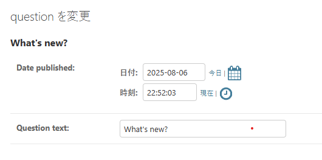
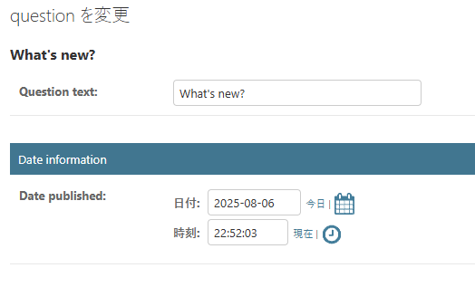
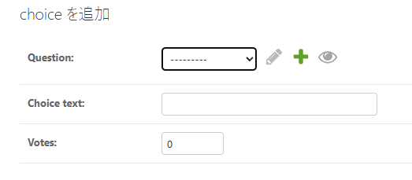
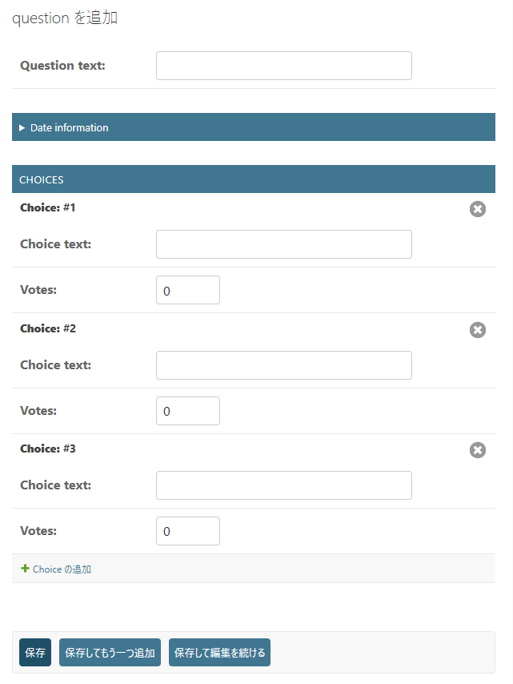
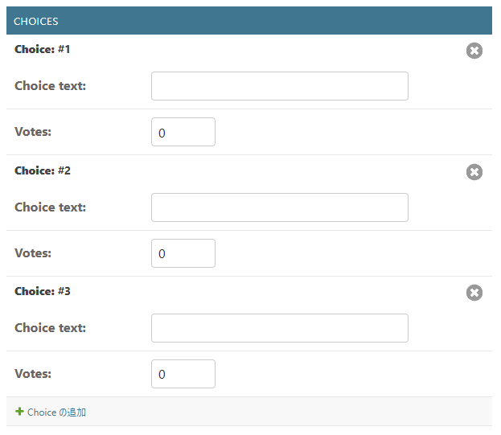
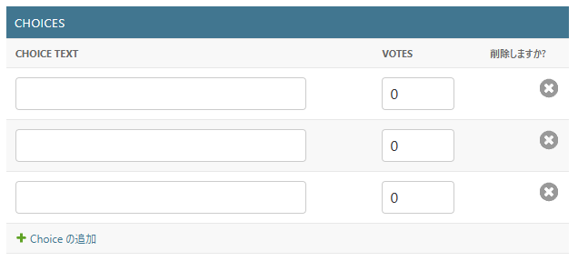
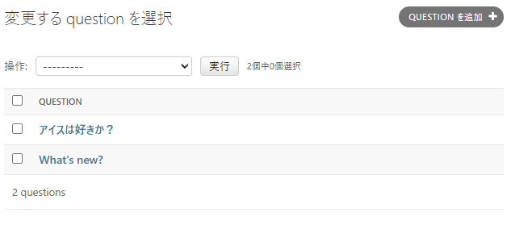
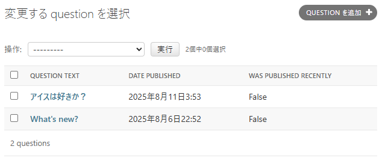
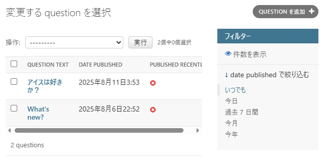

# アプリ作成その 7

```
【困ったときは】

このチュートリアルの実行に問題がある場合は、FAQ の Getting Help セクションに進んでください

```

## admin フォームのカスタマイズ

admin.site.register(Question) の呼び出しによって Question モデルを登録したことで、Django はデフォルトの形式でオブジェクトを表示できました  
admin フォームの表示方法や操作の仕方をデフォルトから変更したいこともよくあります  
それには、オブジェクトを登録する時にオプションを指定します

ためしに、編集フォームでのフィールドの並び順を並べ替えてみましょう  
admin.site.register(Question) の行を以下のように置き換えてみてください

```python3
# polls/admin.py

from django.contrib import admin

from .models import Question


class QuestionAdmin(admin.ModelAdmin):
    fields = ["pub_date", "question_text"]


admin.site.register(Question, QuestionAdmin)
```

このように、モデルの admin のオプションを変更したいときには、モデルごとに admin クラスを作成して、 admin.site.register() の 2 番目の引数に渡すと いうパターンに従ってください

上の例では、「Publication date」フィールドの表示位置を「Question」フィールドよりも前に変更しています:



二つしかフィールドがないので、あまりぱっとした変化ではありませんね  
しかし admin フォームで数十ものフィールドを操作するような場合には、直感的なフィー ルドの並び順というものはユーザビリティ上重要な要素です

また、数十ものフィールドがある場合、フォームを複数のフィールドセットに分割したいこともあるでしょう

```python3
# polls/admin.py

from django.contrib import admin

from .models import Question


class QuestionAdmin(admin.ModelAdmin):
    fieldsets = [
        (None, {"fields": ["question_text"]}),
        ("Date information", {"fields": ["pub_date"]}),
    ]


admin.site.register(Question, QuestionAdmin)
```

fieldsets の各タプルの先頭の要素はフィールドセットのタイトルです  
フォームは以下のように表示されます



## リレーション先オブジェクトの追加

OK、 Question の管理ページはできました  
しかし Question は複数の Choice を持つのに、管理ページには表示されていませんね

現状はそうですが、表示はできます

この問題を解決するには 2 つの方法があります  
1 つ目は、 Question と同じように admin に Choice を登録する方法です:

```python3
# polls/admin.py

from django.contrib import admin

from .models import Choice, Question

# ...
admin.site.register(Choice)
```

これで、Djagono の管理サイト上で「Choice」を選べます  
「Choice の追加」フォームは以下のようになります



このフォームでは「Question」フィールドは選択ボックスで、データベース上の全ての質問を選択できます  
Django は ForeignKey を表示する時には `<select>` ボックスを使わねばならないということを知っているのです  
今の時点では、 Question はデータベース上に一つしかないはずですね

Question フィールドの隣に「別の質問を追加 (Add nother question)」リンクがあるのに注意してください  
ForeignKey の関係にあるオブジェクトなら、何もしなくてもこのリンクが表示されます  
「もう一つ追加」をクリックすると、「別の質問を追加 (Add another question)」というポップアップウィンドウを表示します  
このウィンドウで Question を追加して「保存」を押すと、 Django は Question をデータベースに保存して、もとの 「Choice の追加(Add choice)」フォームに選択済みの項目として動的に追加します

しかし、この方法は Choice オブジェクトをシステムに追加するには効率的ではありません  
Question オブジェクトを追加する時に Choice をひと揃い追加できた方が便利ですよね  
そうしてみましょう

Choice モデルに対する register() を削除して、 Question の登録する部分を以下のように書き換えてください

```python3
# polls/admin.py

from django.contrib import admin

from .models import Choice, Question


class ChoiceInline(admin.StackedInline):
    model = Choice
    extra = 3


class QuestionAdmin(admin.ModelAdmin):
    fieldsets = [
        (None, {"fields": ["question_text"]}),
        ("Date information", {"fields": ["pub_date"], "classes": ["collapse"]}),
    ]
    inlines = [ChoiceInline]


admin.site.register(Question, QuestionAdmin)
```

この行は Django に対して、「Choice オブジェクトは Question の管理ページから編集する  
デフォルトでは、3 つの Choice を表示するのに十分なフィールドを用意すること」と指示しています

「question を追加(Add question)」ページを読み込んで、どのように見えるか確かめてみましょう



変わった点をみてみましょう  
リレーション相手である Choice を表示するために 3 つのスロットがあります (extra に指定した数ですね)  
また、作成済みのオブジェクトを「編集する」ページに行けば、いつでも 3 つ余分のスロットが表示されるはずです

現在の 3 つのスロットの最後に「別の選択肢を追加」というリンクがあります  
これをクリックすると新しいスロットが追加されます  
追加されたスロットを削除したい場合は、追加されたスロットの右上にある × をクリックしてください  
この画像は追加されたスロットを示しています:



さて、このコードにはちょっと問題があります  
というのも、 Choice オブジェク トを入力するためのフィールドを全部表示しようとすると、相当な広さのスクリーンが必要だからです  
このため、 Django にはテーブルを使ってインラインでリレーション相手のオブジェクトを表示する方法があります  
以下のように、 ChoiceInline の宣言を変更してください

```python3
# polls/admin.py

class ChoiceInline(admin.TabularInline): ...
```

StackedInline に代わって TabularInline を使うと、 リレーション相手のオブジェクトはコンパクトなテーブル形式で表示されます:



追加の "Delete?" カラムがあることに注意してください  
このカラムは、 "Added Another Choice" ボタンで追加された行や、すでに保存された行を削除するためにあります

## 管理サイトのチェンジリストページをカスタマイズする

さあ、これで Question の管理ページはだいぶよくなってきました  
今度は「チェンジリスト」ページをすこしいじりましょう  
チェンジリスト (change list) は、システム上の全ての Question を表示するページです

現時点では以下のように表示されています



デフォルトでは、Django は各オブジェクトの str() を表示します  
しかし、個々のフィールドを表示できた方が便利なこともあります  
そのためには、 list_display 管理オプションを使います  
これは、オブジェクトのチェンジリストページで表示するフィールド名のリストをカラムとして表示するものです:

```python3
# polls/admin.py

class QuestionAdmin(admin.ModelAdmin):
    # ...
    list_display = ["question_text", "pub_date"]
```

念のため、 チュートリアル その 2 の was_published_recently() メソッドも含めましょう

```python3
# polls/admin.py

class QuestionAdmin(admin.ModelAdmin):
    # ...
    list_display = ["question_text", "pub_date", "was_published_recently"]
```

これで、Question のチェンジリストのページは以下のようになります:



カラムのヘッダをクリックすると、カラムの値に応じてエントリを並べ換えできます  
ただし was_published_recently ヘッダは例外であり、これはメソッドの戻り値を使った並べ換えをサポートしていないからです  
was_published_recently のカラムヘッダは、デフォルトではメソッド名 (アンダースコアを空白に置き換えたもの) になっていることに注目してください  
また、各行は戻り値の文字列表現となっています

次のように、display() デコレーターをそのメソッドに使用することで改善できます（チュートリアル 2 で作成された polls/models.py ファイルを拡張します）

```python3
# polls/models.py

from django.contrib import admin


class Question(models.Model):
    # ...
    @admin.display(
        boolean=True,
        ordering="pub_date",
        description="Published recently?",
    )
    def was_published_recently(self):
        now = timezone.now()
        return now - datetime.timedelta(days=1) <= self.pub_date <= now
```

デコレータで設定できるプロパティに関する詳しい情報は、list_display を参照してください

polls/admin.py ファイルをもう一度編集して、Question のチェンジリストのページに list_filter を追加して、さらに改良しましょう  
それには、QuestionAdmin に次に行を追加します

`list_filter = ["pub_date"]`

これで、「フィルタ (Filter)」サイドバーができ、チェンジリストを pub_date フィールドの値に従ってフィルタできるようになります



フィルタの種類は、フィルタ対象のフィールドの種類に応じて変化します  
pub_date は DateTimeField なので、Django はこのフィールドにふさわしいフィルタオプションが、「すべての期間 ("Any date")」「今日 ("Today")」「今週 ("Past 7 days")」「今月 ("This month")」であることを知っているのです

いい感じに体裁が整ってきました  
今度は検索機能を追加してみましょう

`earch_fields = ["question_text"]`

これでチェンジリストの上部に検索ボックスが表示されます  
ユーザが検索語を入力すると、 Django は question_text フィールドを検索します  
フィールドはいくらでも使えますが、舞台裏では LIKE クエリを使うのでデータベースに過剰な負荷をかけないために常識的な範囲にしましょう

さて、ここでお知らせしたいこととして、チェンジリストには最初からページ分割機能があります  
デフォルトではページあたり 100 個の要素を表示します  
ページ分割、検索ボックス、フィルタ、日付による階層化、カラムヘッダを使った並び替え の機能は、すべて協調して思いのままに動作します

## 管理サイトのルック&フィールをカスタマイズする

管理サイトの上部には「Django 管理サイト (Django adminstration)」と表示されていますが、これはいささか滑稽ですね  
これは単なるプレースホルダテキストにすぎません

ただし、Django のテンプレートシステムを使用して変更できます  
Django admin は Django 自体を利用しており、そのインターフェースは Django 独自のテンプレートシステムを使用しています

### プロジェクトテンプレートをカスタムする

djangotutorial ディレクトリ内に templates ディレクトリを作成してください  
テンプレートは、Django がアクセスできる任意の場所に配置できます（Django はサーバーが実行されているユーザーとして動作します）  
しかし、プロジェクト内にテンプレートを配置するのが良い慣習とされています

設定ファイル (mysite/settings.py) を開いて、TEMPLATES 設定オプションの中に、次のように DIRS オプションを追加します

```python3
# mysite/settings.py

TEMPLATES = [
    {
        "BACKEND": "django.template.backends.django.DjangoTemplates",
        "DIRS": [BASE_DIR / "templates"],
        "APP_DIRS": True,
        "OPTIONS": {
            "context_processors": [
                "django.template.context_processors.request",
                "django.contrib.auth.context_processors.auth",
                "django.contrib.messages.context_processors.messages",
            ],
        },
    },
]
```

DIRS は、Django がテンプレートを読み込む時にチェックする、ファイルシステム上のディレクトリのリストです  
サーチパスのようなものです

```
【テンプレートの構成】

static ファイルと同じように、すべてのテンプレートを1つの大きな templates ディレクトリにまとめることも 可能 ではあります
しかし、特定のアプリケーションと結びつくテンプレートは、プロジェクトのテンプレートディレクトリ (templates) ではなく、それぞれのアプリケーションのテンプレートディレクトリ (polls/templates など) に置くべきです
なぜ そうするのかについては 再利用可能アプリのチュートリアル で詳しく説明します
```

さて、templates の中に admin という名前のディレクトリを作りましょう  
Django 自体のソースコード内にある、デフォルトの Django admin テンプレートディレクトリ ([django/contrib/admin/templates](https://github.com/django/django/blob/main/django/contrib/admin/templates/admin/base_site.html)) を探して、 admin/base_site.html というテンプレートを、新しく作ったディレクトリにコピーします

```
【Djangoのソースファイルの場所はどこ？】

Django のソースファイルがシステム中のどこにあるのか分からない場合は、以下のコマンドを実行してください


$ python -c "import django; print(django.__path__)"
```

そして、ファイルを編集して {{ site_header|default:_('Django administration') }} を置き換えます  
(中括弧を含む)に自分のサイト名を入れてください  
最終的には、次のようなコードのセクションになるはずです:

```html
<!-- polls/templates/admin/base_site.html -->


<div id="site-name">
    <a href="">Polls Administration</a>
</div>
   
```

このようなアプローチを今使ったのは、テンプレートをオーバーライドする方法を示すためです  
実際のプロジェクトで今行ったのと同じカスタマイズを行いたい場合には、 django.contrib.admin.AdminSite.site_header 属性を使えば、もっと簡単に設定できます

このテンプレートファイルは  や {{ title }} のようなテキストを多く含んでいます  
`{%` と `{{` のタグは Django のテンプレート言語の一部です  
チュートリアル その 3 で見たように、Django が admin/base_site.html をレンダリングする時に、このテンプレート言語が評価され、最終的な HTML ページが生成されます

Django のデフォルトの admin テンプレートはすべてオーバーライドできることに注意してください  
テンプレートを上書きするには、base_site.html で行ったのと同じことをしてください -- デフォルトのディレクトリからカスタムディレクトリにコピーして変更してください

### アプリケーション用の テンプレートをカスタマイズする

するどい読者はこう質問されるでしょう: DIRS はデフォルトで空っぽなのに、 Django はなぜデフォルトの admin テンプレートを見つけることができたのだろう? その答えは APP_DIRS が True に設定されているため、 Django は自動的に各アプリケーションのパッケージのサブディレクトリからフォールバックとして templates/ を探すからです (django.contrib.admin は一つのアプリケーションだということを忘れないでください)

投票アプリケーションはそれほど複雑ではないので、カスタムの admin テンプレートは必要ないでしょう  
しかしアプリケーションがさらに凝ったものに成長し、何か機能を実現するために標準の admin テンプレートを変更する必要が出てきた場合、 アプリケーションの テンプレートを編集するほうが、 プロジェクト のテンプレートを編集するより賢い選択になるでしょう  
そうすれば、投票アプリケーションを他のどの新しいプロジェクトにも追加でき、投票アプリケーションが（自分自身に必要な）カスタムテンプレートを確実に見つけることができます

Django のテンプレートの検索方法に関する詳しい情報は、テンプレート読み込み ドキュメント を参照してください

## admin index ページをカスタムする

近い話題として、 Django の admin index ページのルックアンドフィールをカスタマイズもできます

デフォルトでは、 admin アプリケーションで登録された INSTALLED_APPS のすべてのアプリケーションが、アルファベット順に表示されます  
レイアウトを大きく変更したい場合もあるでしょう  
なんといっても、index ページは admin の中でおそらく最も重要なページなので、使いやすいほうがいいですからね

カスタマイズ対象のテンプレートは admin/index.html です  
(前セクションで admin/base_site.html にしたことと同じことをしてください  
つまり、デフォルトのディレクトリからコピーして、カスタムテンプレートのディレクトリに配置してください)  
編集してみると app_list というテンプレート変数が使われているのがわかるでしょう  
この変数にはインストールされた全 Django アプリが含まれています  
これを使う代わりに、各オブジェクトの admin ページヘのリンクをハードコードし、好きなようにカスタマイズできます
